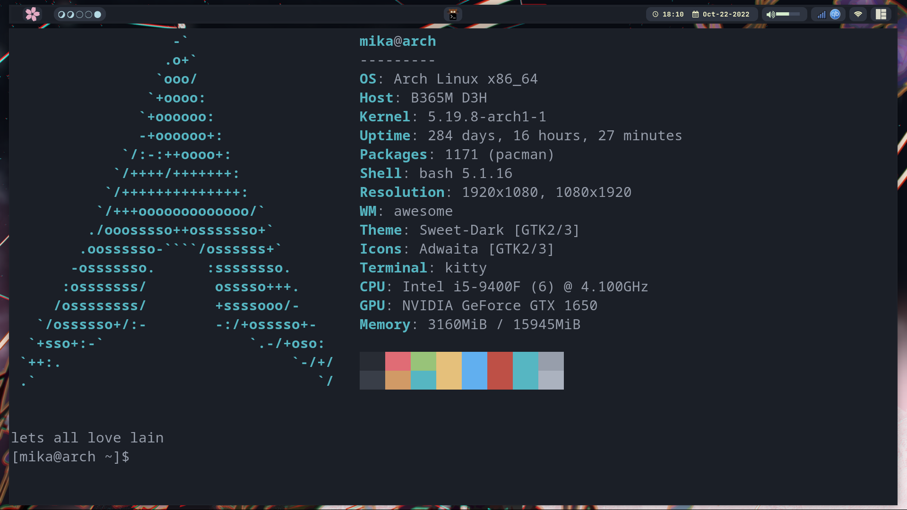
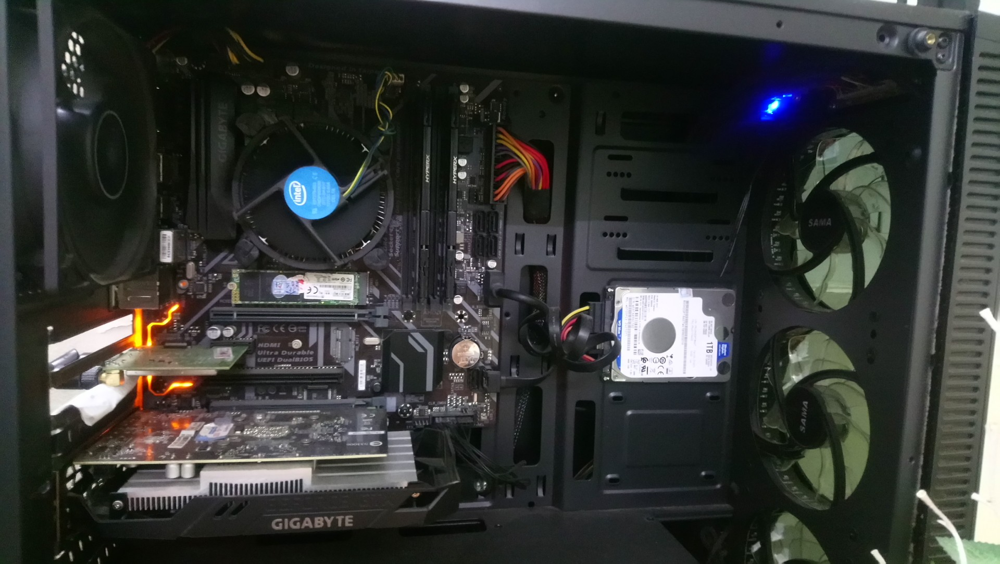
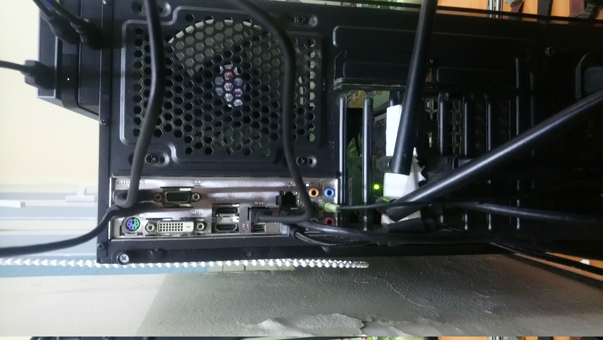
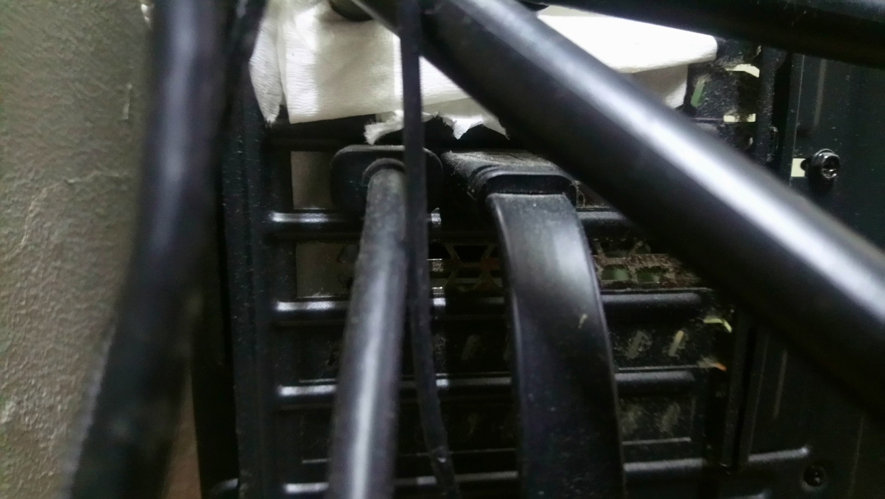
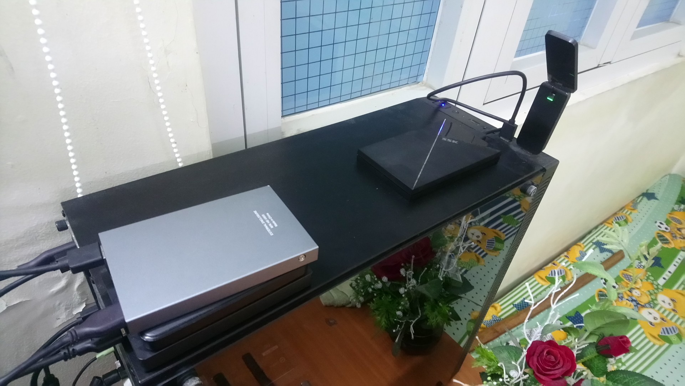
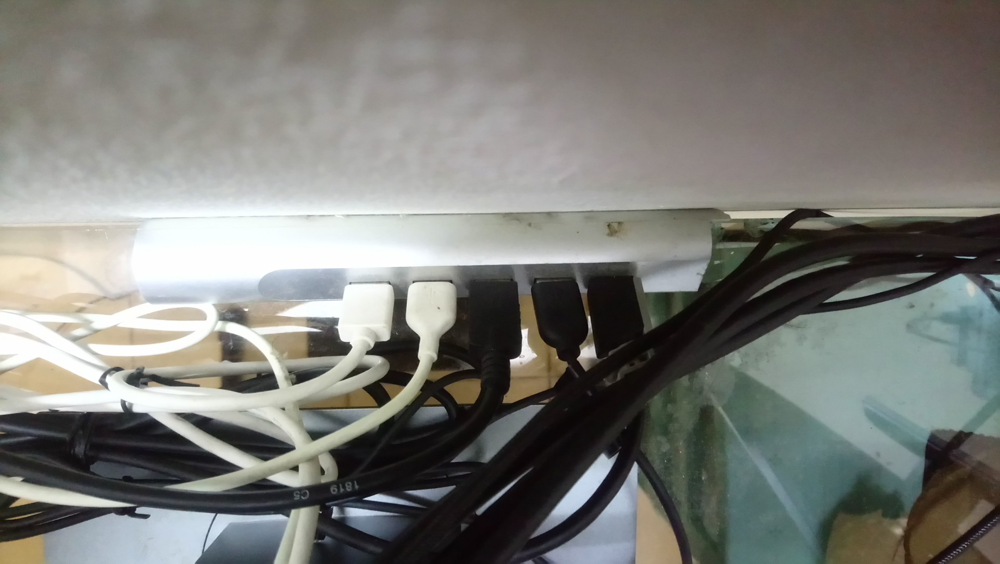

# Lời cảm ơn

Lời đầu tiên em xin được cảm ơn Ths. Phạm Trọng Nghĩa đã giúp đỡ em trong những bước đầu của làm một bản báo cáo phù hợp và chuyên nghiệp cho môi trường đại học. Tiếp theo là cảm ơn gia đình đã luôn bên cạnh cổ vũ tinh thần giúp em hoàn thành sản phẩm. Sau cùng, cảm ơn Sở Giáo dục Thành phố Hồ Chí Minh đã khen thưởng cho em đủ kinh phí để sắm sửa chiếc máy tính trong bài báo cáo này.
\pagebreak

\setcounter{tocdepth}{2}
\renewcommand*\contentsname{Mục Lục}
\tableofcontents
\pagebreak
\renewcommand*\listfigurename{Danh Mục Hình}
\listoffigures
\pagebreak
\renewcommand*\listtablename{Danh Mục Bảng}
\listoftables
\pagebreak

\pagebreak

## 1. Mainboard

Trong hình bao gồm:

- Mainboard: **Gigabyte B365M-D3H**
- CPU: **Intel i5-9400F; 4.10GHz; 9M cache** — Chip tiết kiệm điện. Được cắm trên socket LGA 1151.
- GPU: **VGA Gigabyte GeForce GTX 1650 OC 4G** — Card giá rẻ ở thời điểm được mua. Được cắm vào cổng PCI EX16.
- RAM: **DDR4 Kingstone HyperX Fury Black 8Gb** — 2 cái được cắm vào 2 khe RAM DDR4 chạy dual channel.
- SSD: **Transcend 820s 240Gb M2 Sata3** — Được cắm trực tiếp vào cổng M2
- HDD: **WD 1Tb 2.5’’ Sata3 5400** — Được cắm vào cổng SATA 3
- PSU: **Cooler Master 500W Elite V3**
- PCI Wifi Adapter: **D-Link DWA-582** — Được cắm vào cổng PCI EX1
- Sound Card: **HDA-Intel PCH** đi kèm Mainboard

Tổng giá thành 13 triệu đồng.

\pagebreak

## 2. Các cổng kết nối với Mainboard

Các cổng kết nối từ trái sang:

- 2 cổng **USB 3.0** được gắn với 2 thiết bị lưu trữ ngoại vi và một cổng **PS/2 Keyboard/Mouse Port**
- Cổng **D-Sub Port** và cổng **DVI-D Port**
- Một cổng **Display Port** và một cổng **HDMI** tích hợp trên Mainboard.
- Một cổng **USB 3.0** được cắm với thiết bị lưu trữ ngoại vi; Một cổng **USB Type-C**
- Một cổng **LAN RJ-45**; Một cổng **USB 3.0** được cắm với **USB HUD**; Một cổng **USB 3.0** khác được cắm với Microphone tích hợp.

Các cổng âm thanh:

- Màu cam: Cổng âm thanh cho loa trung tâm
- Màu đen: Cổng cho loa sau
- Màu xám: Cổng cho loa vệ tinh
- Màu xanh lam: Cổng xuất âm thanh Analog
- Màu xanh lá: Cổng xuất âm thanh ra loa
- Màu đỏ: Cổng microphone

\pagebreak

## 3. Các cổng kết nối bổ sung

{width=75%}

{width=75%}

\pagebreak

(Figure 4) Các cổng kết nối xuất từ card đồ họa:

- 2 cổng **HDMI**; Một trong số đó được gắn với màn hình rời.
- 1 cổng **Display Port** được gắn với màn hình rời.

(Figure 5) Các cổng kết nối trên case:

- 2 cổng kết nối Microphone và Headphone
- 2 cổng **USB 2.0**, một trong số đó được kết nối với một thiết bị lưu trữ ngoại vi
- 1 cổng **USB 3.0** được cắm với USB Wifi Adapter **TP-Link Archer T4U**. Có thể sử dụng `networkctl` để sử dụng cả 2 Adapter cùng lúc. Cụ thể, một vài phầm mềm được chỉ định sẽ sử dụng USB Adapter, tất cả các phầm mềm còn lại sẽ sử dụng PCI Adapter.

## 4. Các cổng kết nối tới các thiết bị nhập xuất ngoại vi

Từ trái sang phải:

- Đầu vào của USB HUB
- Dây kết nối với điện thoại thông minh
- Dây kết nối với máy in
- Dây kết nối với chuột máy tính
- Dây kết nối với bàn phím

\pagebreak

## 5. Các thiết bị ngoại vi

- 2 màn hình DELL P2319H
- Một bàn phím, một chuột, một microphone, một bên loa vệ tinh
